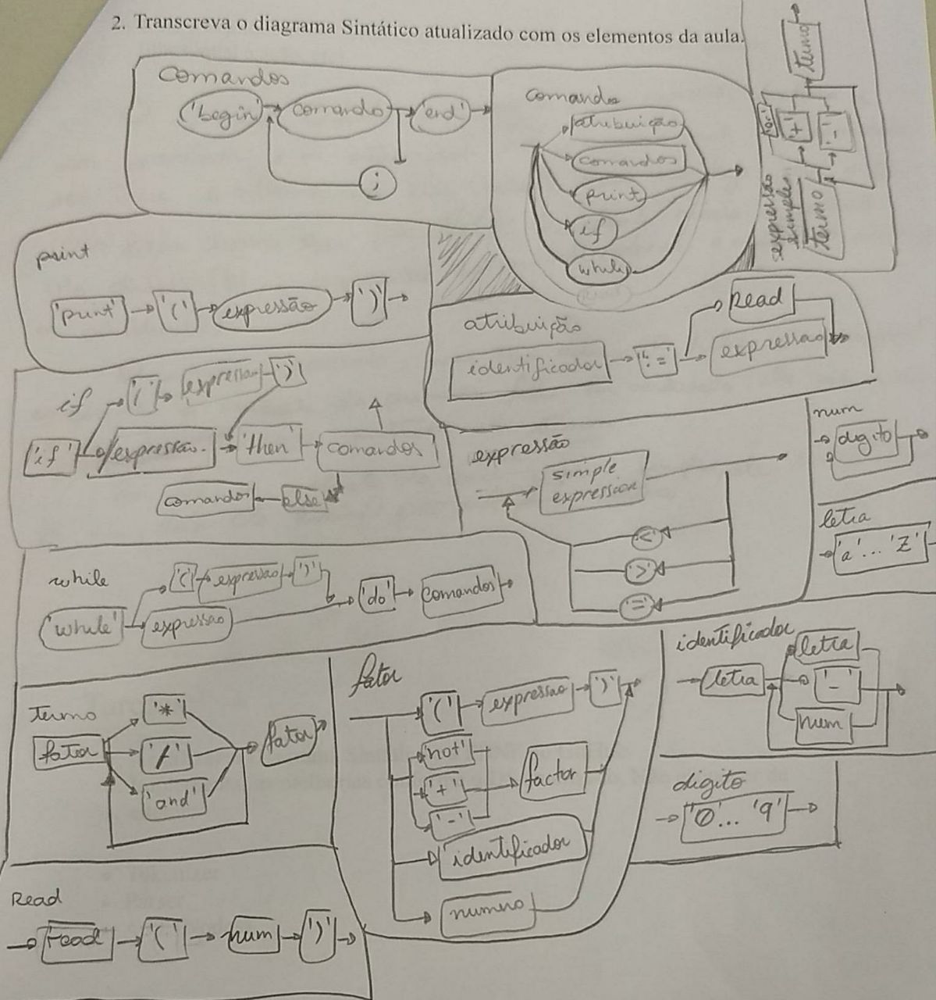

# pascal-compiler
Yep, you read it

## EBNF
```
expr = term (('+' | '-') term)*
term = fact (('*' | '/') fact)*
fact = '(' expr ')' | num | ('-'|'+') fact
```

Nova EBNF
```
programa = progdec, {vardec}, {comandos}, '.';
progdec = 'program', identificador, ';';
vardec = 'var', {identificador, {',', identificador}, ':', tipo, ';'};
tipo = ('boolean', 'integer');
comandos = 'begin', comando, {';', comando}, 'end';
comando = atribuicao | comandos | print | if | while;
if = 'if', expressao, 'then', comandos, ['else', comandos];
while = 'while', expressao, 'do', comandos;
print = 'print', '(', expressao, ')';
atribuicao = identificador, ':=', (expressao | read);
read = 'read', '(', ')';
expressao = expressao_simples, {('<' | '>' | '='), expressao_simples};
expressao_simples = termo, {('or' | '+', '-'), termo};
termo = fator, { ('*' | '/' | 'and'), fator };
fator = ({'+' | '-' | 'not'}, fator) | numero | '(', expressao, ')' | identificador;
identificador = (letra | '_'), {letra | digito | '_'};
numero = digito, {digito};
letra = (a | ... | z | A | ... | Z);
digito = (0 | ... | 9);
```

## Diagrama Sintático


